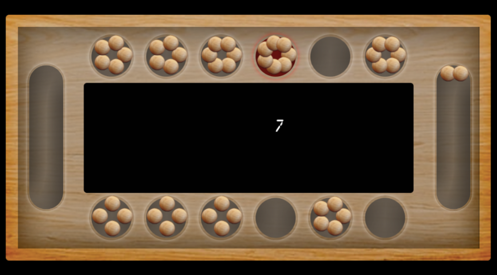

**MANCALA GAME IMPLEMENTATION**

https://yukamo.de/en/game_en/



**ASSUMPTIONS:**

House: The small circles on the board 
Store: The rectangle boxes at each corner
Pits: All houses and Stores are Pits
Players count: 2. Player1 will always make the first move.

For test cases, I have taken smaller size of seeds and houses. 2 & 4 respectively.


For now, this project creates 6 houses with 2 seeds in each house for the players.

**RULES:**
1. All players can add seed to all houses
2. Only current player can add seed to his/her store
3. The movement has to be in clockwise direction
4. Bonus move given to player if last seed lands in player's store
5. If the last stone lands in an empty house on player's side of the
   board, s(he) get to take that stone— plus all of your opponent’s stones that
   are in the opposite house— and place them in player's own Mancala Store.

**JDK version used:** 19


RUN MancalaApplication.java

A prompt like this will appear

````
Enter Number of Houses, should be either 4  or 6
6
Enter Number of Seeds
4
Mancala Board:::
               Player Two
      | 04 | 04 | 04 | 04 | 04 | 04
(04)                                 (04)
      | 00 | 00 | 04 | 04 | 04 | 04
               Player One


Player ONE playing
Enter pit number from 1-: 6
````

**Both the players should alternatively take turns for the moves as prompted on the screen.** 